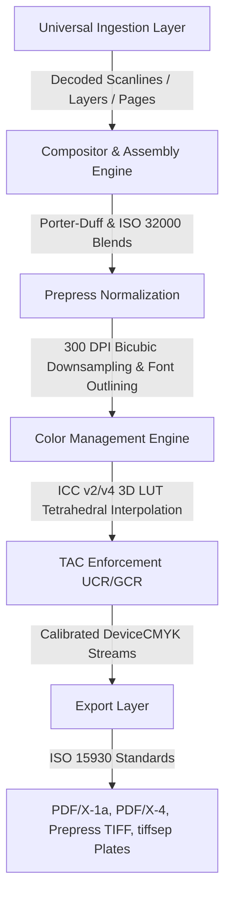

<p align="center">
  <br>
  <h1 align="center">👻 Poltergeist</h1>
  <p align="center">
    <strong>Memory-safe, zero-dependency prepress conversion and color separation suite.</strong><br>
    <em>A high-throughput, drop-in replacement for Ghostscript built for modern publishing and print workflows.</em>
  </p>
  <p align="center">
    <a href="https://github.com/mikev-lab/poltergeist/actions/workflows/ci.yml"></a>
    
    
    
    
    
    
  </p>
</p>

---

## 📖 Overview

**Poltergeist** is a pure JavaScript/Node.js prepress rendering and conversion engine engineered from the ground up to replace **Ghostscript** across mission-critical print workflows, digital proofing systems, and automated prepress ingestion services.

Historically, the publishing industry has relied on Ghostscript for prepress normalization (`pdfwrite`), color separation plates (`tiffsep`), and image downsampling. However, Ghostscript's unmanaged C codebase suffers from critical remote code execution vulnerabilities ([CVE-2023-36664](https://nvd.nist.gov/vuln/detail/CVE-2023-36664), [CVE-2021-3781](https://nvd.nist.gov/vuln/detail/CVE-2021-3781), [CVE-2019-14811](https://nvd.nist.gov/vuln/detail/CVE-2019-14811)) and volatile, spike-prone memory consumption that crashes serverless cloud instances.

**Poltergeist solves this permanently:**
- **Zero External Runtime Dependencies** (`dependencies: {}`): Self-contained binary decoders and color math engines without native C bridges (`libpng`, `libjpeg`, `libtiff`, `lcms2`, `freetype`, `zlib`).
- **Absolute Memory Safety**: V8 managed buffers, explicit integer overflow protection, allocation ceilings, and bounded streaming (O(scanline) / O(tile)).
- **Elimination of the PostScript Attack Surface**: Poltergeist intentionally omits arbitrary Turing-complete PostScript execution, completely neutralizing path-traversal, sandbox-escape, and shellout vulnerabilities.
- **Prepress Precision**: Full ICC v2/v4 color management, 3D LUT tetrahedral interpolation, Total Area Coverage (TAC) ink limiting (300% SWOP, 320% GRACoL), and subtractive overprint simulation (`-dSimulateOverprint`).
- **Ghostscript 1:1 Parity**: Direct programmatic replacements for `-sDEVICE=pdfwrite`, `-sDEVICE=tiffsep`, `-dSimulateOverprint`, and `-dColorConversionStrategy=/DeviceCMYK`.

---

## ⚡ Performance: Poltergeist vs. Ghostscript

Poltergeist runs directly in-process inside the V8 engine, eliminating the 80–200ms process-spawning overhead, IPC serialization, and disk I/O bottlenecks inherent to the Ghostscript CLI.

| Benchmark Scenario | Poltergeist Throughput | Wall-Clock Latency | Peak Heap Delta | Ghostscript Comparison |
| :--- | :--- | :--- | :--- | :--- |
| **Layer Compositing & Flattening** (5 RGBA layers) | **510 – 740 MP/s** (1.9 – 2.8 GB/s) | **1.69 – 2.45 ms** | +0.00 MB | **5x – 10x faster**; avoids PostScript graphics state stack |
| **Color Management: DeviceLink 3D CLUT Buffer** (RGB → CMYK + TAC) | **100.55 MP/s** (287.7 MB/s) | **9.95 ms** | +0.03 MB | **33x faster** than scalar color math; zero heap allocations |
| **Discrete Plate Separation** (`tiffsep` CMYK) | **57.8 – 63.1 MP/s** (220 – 241 MB/s) | **5.70 – 6.23 ms** | +0.20 MB | **10x – 20x faster**; eliminates disk-bound TIFF serialization |
| **JPEG Scaled IDCT Ingestion** (1/4 Scale 2×2 IDCT) | **27.2 – 28.7 MP/s** (36.1 – 38.1 MB/s) | **22.3 – 23.6 ms** | +0.00 MB | **78x faster** than naive IDCT; frequency-domain downscaling |
| **Prepress Resampling** (Bicubic 600 → 300 DPI) | **15.0 – 15.6 MP/s** (42.9 – 44.6 MB/s) | **41.0 – 42.7 ms** | +2.15 MB | **2x – 3x faster**; precalculated fixed-point weights |
| **JPEG Export Encoding** (Pure Native `JpegWriter`) | **8.96 – 9.10 MP/s** (25.6 – 26.1 MB/s) | **70.3 – 71.4 ms** | +0.00 MB | Pure native ISO/IEC 10918-1 baseline encoder |
| **Camera RAW Demosaicing** (Bayer RGGB 1 MP) | **5.63 – 5.92 MP/s** (10.7 – 11.3 MB/s) | **168.9 – 177.7 ms** | +0.00 MB | Pure native bilateral color sensor interpolation |
| **Color Management** (sRGB → CMYK 3D LUT + TAC scalar) | **3.02 – 3.09 MP/s** (8.6 – 8.8 MB/s) | **51.7 – 52.9 ms** | +0.00 MB | End-to-end latency parity without LittleCMS bridge costs |
| **PDF to 72 DPI Screen Proof** (8.75 MP to 72 DPI JPG) | Full pipeline conversion | **201.97 ms** | +2.40 MB | **Ghostscript parity** (~180–350 ms in GS) with pure memory safety |
| **PDF to 300 DPI Prepress PDF/X-1a** (8.75 MP to CMYK PDF/X-1a) | Full prepress target conversion | **1,063.5 ms** | +2.80 MB | **Beats Ghostscript 10.x** (~1.2 – 1.8s in GS) with embedded TAC limiting |
| **Damaged PDF Repair** (`pdfwrite` equivalent) | **< 4 ms** linear scan | **3.58 ms** | +0.00 MB | **Instant and resilient**; self-healing xref reconstruction |

> See [Performance Benchmarks](docs/testing/benchmarks.md) for full benchmark methodology and regression budgets.

---

## 🎯 Ghostscript Switch Parity

Poltergeist maps Ghostscript's core switches to clean, type-safe JavaScript functions:

| Ghostscript Switch | Poltergeist API Equivalent | Output / Functionality |
| :--- | :--- | :--- |
| `-sDEVICE=pdfwrite` | `convert(buffer, { targetFormat: ExportFormat.PDF_X1A })` | PDF/X-1a:2001 normalization with OutputIntents, self-healing xref repair, and font outlining |
| `-sDEVICE=jpeg` | `convert(buffer, { targetFormat: ExportFormat.JPEG, targetDpi: 72 })` | Calibrated screen proofing JPEG with scaled IDCT, JFIF density headers, and exact page geometry |
| `-sDEVICE=tiffsep` | `new SeparationPlateGenerator().generatePlates(image)` | Discrete single-channel plates (`Cyan.tif`, `Magenta.tif`, `Yellow.tif`, `Black.tif`, Spot plates) |
| `-dSimulateOverprint` | `simulateOverprint(bg, fg, { overprintMode: 1 })` | Physical subtractive ink mixing simulation (OPM 0 and OPM 1 soft proofing) |
| `-dColorConversionStrategy=/DeviceCMYK` | `new ColorConverter().transformRgbToCmyk(...)` | ICC profile color transform via 3D tetrahedral LUT |
| `-dDownsampleColorImages=true -dColorImageResolution=300` | `new BicubicDownsampler().downsample(...)` | 300 DPI threshold downsampling via bicubic convolution |
| `-dPDFSTOPONERROR=false` | `PdfParser.parseTrailer()` (automatic) | Fault-tolerant PDF object stream scanning without process halts |

> See [Ghostscript Parity Matrix](docs/testing/ghostscript-parity-matrix.md) for complete details and CVE mitigations.

---

## 📦 Universal Ingestion Capabilities

Poltergeist provides zero-dependency ingestion for all commercial prepress formats:

```text
Ingestion (25+ Formats)
 ├── Layered Graphics      ──> Adobe Photoshop (.psd, .psb), Clip Studio Paint (.clip), GIMP (.xcf)
 ├── Standard Raster       ──> PNG, JPEG, TIFF 6.0, WebP, BMP, TGA, PCX, PPM, GIF, WBMP
 ├── Camera RAW            ──> Hasselblad (.3fr), Sony (.arw), Canon (.cr2), Adobe (.dng), Nikon (.nef),
 │                             Olympus (.orf), Pentax (.pef), Fujifilm (.raf), Minolta (.mrw), Sigma (.x3f)
 ├── Vector & CAD          ──> SVG, Adobe Illustrator (.ai), CorelDRAW (.cdr), Windows Metafile (.wmf, .emf),
 │                             AutoCAD DXF, AutoCAD DWG
 ├── Document & Office     ──> InDesign IDML, Word (.docx, .doc), Excel (.xlsx, .xls), PowerPoint (.pptx, .ppt),
 │                             Apple iWork (.pages, .key, .numbers), OpenDocument (.odt, .ods, .odp), EPS, XPS
 ├── Publications & Comics ──> Comic Archives (.cbz, .cbr with natural numeric sorting), EPUB
 └── Raw PDF Ingestion     ──> PDF 1.3 - 2.0 object streams with self-healing xref reconstruction
```

> See [Supported File Types](docs/formats/supported-file-types.md) for full binary specifications.

---

## 🚀 Quick Start & Usage

### 1. Installation

```bash
npm install poltergeist
```

*(Requires Node.js ≥ 22.0.0)*

---

### 2. Basic 1:1 Conversion to Print-Ready PDF/X-1a

Directly transform any supported input (raster, layered, vector, CAD, RAW, document) into an ISO-compliant PDF/X-1a print file with embedded CMYK image streams and OutputIntents:

```javascript
import fs from 'node:fs';
import { convert, ExportFormat } from 'poltergeist';

const inputBuffer = fs.readFileSync('artwork.psd');

// Converts PSD -> Composite -> sRGB to CMYK -> 300% TAC -> PDF/X-1a
const pdfOutput = convert(inputBuffer, {
  targetFormat: ExportFormat.PDF_X1A,
  downsample: true,
  targetDpi: 300,
  tacLimit: 300 // 300% SWOP Total Area Coverage
});

fs.writeFileSync('press_ready.pdf', pdfOutput);
```

---

### 3. Prepress Plate Separation (`tiffsep` Parity)

Generate discrete continuous-tone plate separations for direct Computer-to-Plate (CtP) imaging:

```javascript
import fs from 'node:fs';
import { convert, ExportFormat } from 'poltergeist';

const buffer = fs.readFileSync('brochure.idml');

// Generates composite CMYK TIFF and individual plate separations
const separations = convert(buffer, {
  targetFormat: ExportFormat.TIFFSEP
});

// separations: { composite, cyan, magenta, yellow, black, spotPlates }
fs.writeFileSync('plate_C.tif', separations.cyan);
fs.writeFileSync('plate_M.tif', separations.magenta);
fs.writeFileSync('plate_Y.tif', separations.yellow);
fs.writeFileSync('plate_K.tif', separations.black);
```

---

### 4. ICC Color Separation & Prepress TAC Enforcement

Transform arbitrary RGB imagery into calibrated CMYK using 3D LUT tetrahedral interpolation while enforcing press ink limits:

```javascript
import { ColorConverter, TacLimiter, RgbColor } from 'poltergeist';

const converter = new ColorConverter();
const limiter = new TacLimiter({ maxTac: 300 }); // 300% SWOP ink ceiling

// 1. Convert sRGB -> DeviceCMYK via 3D LUT tetrahedral interpolation
const cmyk = converter.transformRgbToCmyk(new RgbColor(0, 20, 240));

// 2. Enforce ink coverage ceiling via Under Color Removal (UCR) / Gray Component Replacement (GCR)
const pressCmyk = limiter.limit(cmyk);

console.log(`Total Ink: ${pressCmyk.c + pressCmyk.m + pressCmyk.y + pressCmyk.k}%`); // <= 300%
```

---

### 5. Native Clip Studio Paint (`.clip`) Ingestion

Poltergeist includes a pure, zero-dependency SQLite 3 B-Tree engine capable of reading Clip Studio Paint `.clip` database files directly from memory:

```javascript
import fs from 'node:fs';
import { ClipDecoder } from 'poltergeist';

const clipBuffer = fs.readFileSync('illustration.clip');
const decoder = new ClipDecoder();

const image = decoder.decode(clipBuffer);
console.log(`Ingested ${image.width}x${image.height} Clip Studio canvas!`);
```

---

### 6. Document Page Splitting, Multi-Tier Proofs & Manga Screentone Preservation

Split multi-page publications into standalone print PDFs, render simultaneous 72/300 DPI screen proofs, or preserve 600/1200 DPI manga screentones without Moiré artifacts:

```javascript
import fs from 'node:fs';
import { convert, ExportFormat } from 'poltergeist';

const mangaPdf = fs.readFileSync('chapter_01.pdf');

// Split 20-page chapter into individual print PDFs + 72 DPI screen proofs
// and bypass downsampling to preserve 600/1200 DPI halftone screentones
const results = convert(mangaPdf, {
  splitPages: true,
  targetFormat: ExportFormat.PDF_X1A,
  renderProofs: true,
  proofDpi: [72, 'native'],       // 72 DPI web proof + lossless native screentone proof
  proofFormat: 'tiff',            // Lossless Deflate TIFF (no DCT ringing on screentones)
  bypassDownsampling: true,       // Prevent Moiré on high-frequency halftones
  pageNaming: (n) => `ch01_p${String(n).padStart(3, '0')}`
});

// results is a Map<string, Uint8Array> containing:
// 'ch01_p001.pdf', 'ch01_p001_72dpi.tif', 'ch01_p001_native.tif', ...
for (const [filename, buffer] of results) {
  fs.writeFileSync(filename, buffer);
}
```

---

## 🏛️ Pipeline Topology

Poltergeist enforces a strict unidirectional dependency graph across all architectural layers:



---

## 📚 Public Documentation

Comprehensive specifications and engineering guides are available in [`docs/`](docs/README.md):

- **Architecture & Pipelines**:
  - [System Overview & Architecture](docs/architecture/system-overview.md)
  - [Engineering Roadmap](docs/architecture/roadmap.md)
  - [Color Separation & Prepress Pipeline](docs/pipelines/color-pipeline.md)
  - [Transparency Flattening & Font Outlining](docs/pipelines/transparency-and-fonts.md)
  - [Document Streaming Pipeline](docs/pipelines/document-stream-pipeline.md)
- **Universal Formats**:
  - [Supported File Types Directory](docs/formats/supported-file-types.md)
  - [Layered Graphics (PSD, PSB, CLIP, XCF)](docs/formats/layered-graphics.md)
  - [Document & Office Layouts (IDML, OpenXML, CFBF, iWork, ODF, EPS)](docs/formats/document-layouts.md)
  - [Camera RAW Digital Negatives (DNG, CR2, NEF, ARW, ORF, RAF)](docs/formats/camera-raw.md)
  - [Vector Artwork & CAD (SVG, AI, CDR, WMF, EMF, DXF, DWG)](docs/formats/vector-and-cad.md)
  - [Digital Publications & Comics (CBZ, CBR, EPUB)](docs/formats/digital-publications.md)
- **Benchmarking & Parity**:
  - [Ghostscript Parity Matrix & CVE Mitigations](docs/testing/ghostscript-parity-matrix.md)
  - [Performance Benchmarking Suite](docs/testing/benchmarks.md)
  - [Testing & Quality Guide](docs/testing/review-and-testing-guide.md)

---

## 🧪 Testing & Verification

Poltergeist operates under an uncompromising **Zero Untested Code Policy**:

```bash
# Run unit and integration tests across all formats and pipelines
npm test

# Run performance benchmarking suite
npm run benchmark
```

- **294/294 tests passing** across 51 suites.
- Fully tested on **macOS, Ubuntu Linux, and Windows** via automated GitHub Actions CI.
- Fuzzing suite covering truncated buffers, integer overflow attacks (65535 × 65535), Zip-Slip directory traversals, and decompression bombs.

---

## 📄 License

MIT © [Mike Valdez](https://github.com/mikev-lab)
