# Poltergeist Exhaustive System Architecture Specification

## 1. Architectural Vision & Foundational Guarantees

**Poltergeist** is an autonomous, memory-safe, zero-external-dependency prepress file processing suite engineered to completely replace Ghostscript across commercial printing, high-volume digital publishing, and color-accurate contract proofing.

### 1.1 The Ghostscript Replacement Imperative
Ghostscript has historically introduced catastrophic security vulnerabilities and resource unpredictability into graphic arts pipelines:
- **Historical Memory Corruption**: Numerous CVEs (buffer overflows, heap corruptions, out-of-bounds reads/writes) caused by unchecked pointer arithmetic in legacy C/C++ libraries.
- **Unbounded Heap Footprints**: Naive full-file rasterization causing severe Out-Of-Memory (OOM) crashes on large-format prepress assets (e.g. 1200 DPI double-page spreads or multi-gigabyte layered PSDs).
- **PostScript Arbitrary Execution**: Insecure PostScript interpreters allowing arbitrary file system access and remote shell injection.

Poltergeist eliminates these attack surfaces and operational risks through three foundational invariants:
1. **Zero External Runtime Dependencies**: All binary decoders, rasterizers, mathematical color transforms, and file encoders are pure, native implementations maintained inside this repository. No dynamic linking to `libpng`, `libjpeg`, `LittleCMS`, `Ghostscript`, or native shared libraries.
2. **Deterministic Bounded Memory**: Peak working memory scales as O(tile) or O(scanline), never scaling linearly with overall file size (O(file_size)).
3. **Formal Prepress Mathematical Correctness**: Strict compliance with graphic arts standards, including ICC v2/v4 Profile Connection Spaces, 3D LUT tetrahedral interpolation, deterministic Total Area Coverage (TAC) ink limiting, and standard CIEDE2000 tolerances (ΔE00 ≤ 1.0).

---

## 2. End-to-End Pipeline Topology

```mermaid
flowchart TD
    subgraph Ingestion ["Layer 1: Unified Ingestion Engine"]
        A1[Layered Graphics: PSD / PSB / CLIP / XCF]
        A2[Standard Raster: PNG / JPG / TIFF / WEBP / HEIC]
        A3[Camera RAW: DNG / CR2 / NEF / ARW / RAW]
        A4[Vector & CAD: SVG / AI / EPS / CDR / DWG / DXF]
        A5[Office & Document: IDML / DOCX / XLSX / PPTX / PAGES]
        A6[Publications & Comics: CBZ / CBR / EPUB / MOBI]
        A7[Raw PDF Ingestion & Repair: PDF 1.3 - 2.0]
    end

    subgraph MemoryMgr ["Streaming Memory Buffer Ring"]
        B1[Scanline / Tile Chunk Allocator]
        B2[Backpressure & Disposal Ring]
    end

    subgraph Compositing ["Layer 2: Compositor & Page Assembly Engine"]
        C1[Porter-Duff Blend Operator]
        C2[Clipping Mask & Alpha Blender]
        C3[Prepress Resampling: Bicubic 300 DPI]
        C4[PDF/X-1a Transparency Flattener]
        C5[Overprint Simulation & Font Outlining]
        C6[1:1 Page Geometry & Coordinate Mapping]
    end

    subgraph ColorCMM ["Layer 3: Color Management Engine"]
        D1[ICC v2 / v4 Binary Parser]
        D2[TRC Linearization & PCS Transform]
        D3[3D/4D CLUT Tetrahedral Interpolation]
        D4[Prepress TAC Limiting: UCR / GCR]
        D5[Spot Colors & DeviceN / Separation Plates]
    end

    subgraph Export ["Layer 4: Production Export Target"]
        E1[PDF/X-1a:2001 Generator]
        E2[PDF/X-4:2010 Generator]
        E3[Prepress TIFF 6.0 CMYK]
        E4[Calibrated Proofing JPEG]
        E5[Separation Plates: tiffsep C/M/Y/K/Spots]
    end

    Ingestion --> MemoryMgr
    MemoryMgr --> Compositing
    Compositing --> ColorCMM
    ColorCMM --> Export
```



---

## 3. Layer 1: Unified Ingestion Architecture

### 3.1 Layered Graphics Decoders (`src/ingestion/layered/`)

#### 3.1.1 Adobe Photoshop (`.psd`, `.psb`)
- **Header Structure (26 bytes)**:
  - Magic bytes: `38 42 50 53` (`8BPS`). Version: `1` (PSD: dimensions ≤ 30,000 px) or `2` (PSB: dimensions ≤ 300,000 px).
  - Channels (1–56), Depth (1, 8, 16, 32 bits per channel), Color Mode (Bitmap, Grayscale, Indexed, RGB, CMYK, Multi-channel, Duotone, Lab).
- **Color Mode Data**: Palette lookups for indexed modes.
- **Image Resources**: Chunks tagged `8BIM`. Extracts resolution info (`0x03ED`), embedded ICC profiles (`0x040F`), alpha channel metadata, and slice descriptors.
- **Layer and Mask Information**:
  - Layer Records: 4-coordinate bounding box (top, left, bottom, right), channel count and lengths, blend mode 4-character signatures (`norm`, `dark`, `lite`, `mul `, `scrn`, `over`, etc.), opacity byte (0–255), clipping flags, and extra data fields.
  - Channel Decompression: Compression flag: 0 (Raw), 1 (RLE PackBits), 2 (ZIP without prediction), 3 (ZIP with prediction).
  - Scanline un-PackBits: byte-by-byte run-length decoding with explicit buffer bounds guards.

#### 3.1.2 Clip Studio Paint (`.clip`)
- **Container Architecture**: SQLite 3 container database. Magic bytes: `53 51 4C 69 74 65 20 66 6F 72 6D 61 74 20 33 00`.
- **Pure Zero-Dependency Reader**:
  - Implements a pure SQLite B-Tree file reader that traverses internal database pages without external SQLite C libraries.
  - Table Catalog Discovery: Traverses `sqlite_master` to resolve schema tables: `Canvas`, `Layer`, `LayerParam`, `ImageBlock`, `CanvasPreview`.
- **Layer & Hierarchy Resolution**:
  - `Canvas`: Extracts canvas dimensions, DPI resolution, and color profile indicator.
  - `Layer`: Resolves layer tree hierarchy (parent-child folders), layer order, opacity, and visibility flags.
  - `LayerParam`: Extracts blend modes and clipping mask linkages.
  - `ImageBlock`: Reads chunked 8-bit/16-bit raster image tiles compressed via Deflate/zlib and PNG streams. Reconstructs layer channels incrementally.

#### 3.1.3 GIMP (`.xcf`)
- **Header**: Magic bytes `gimp xcf v***`.
- **Channel & Hierarchy**: Traverses layer offset pointers, extracting channel tiles (64 × 64 blocks) compressed via RLE or zlib.

---

### 3.2 Standard Raster Decoders (`src/ingestion/raster/`)

#### 3.2.1 Portable Network Graphics (PNG)
- **Signature**: `89 50 4E 47 0D 0A 1A 0A`.
- **Chunk Traversal**: Validates 4-byte chunk lengths and CRC-32 checksums.
- **Critical Chunks**:
  - `IHDR`: Width, Height, Bit Depth (1, 2, 4, 8, 16), Color Type, Compression (0), Filter (0), Interlace (0/1).
  - `PLTE`: Color palette for indexed color modes.
  - `IDAT`: Compressed pixel payload uncompressed via Deflate.
  - `IEND`: Terminal chunk.
- **Scanline Un-filtering**:
  Reconstructs original byte values across five standard filter methods:
  - None (x = Filt(x))
  - Sub (x = Filt(x) + Prior)
  - Up (x = Filt(x) + Above)
  - Average (x = Filt(x) + floor((Prior + Above) / 2))
  - Paeth: Computes p = a + b - c, calculates |p - a|, |p - b|, |p - c|, returning closest predictor.
- **Ancillary Prepress Chunks**:
  - `iCCP`: Extracts raw embedded ICC profile buffer.
  - `pHYs`: Converts pixels-per-meter into print resolution (DPI = PPM × 0.0254).
  - `sRGB`, `gAMA`, `cHRM`: Fallback colorimetry coordinates.

#### 3.2.2 JPEG (`.jpg`, `.jpeg`)
- **Marker Stream Parsing**: `SOI` (`0xFFD8`), `APP0` (JFIF DPI), `APP2` (ICC profile chunks), `DQT` (Quantization tables), `SOF0`/`SOF2` (Frame headers), `DHT` (Huffman tables), `DRI` (`0xFFDD`) and restart markers (`0xFFD0`–`0xFFD7`), `SOS` (Scan header), `EOI` (`0xFFD9`).
- **Color Spaces**: Supports 1-channel Grayscale, 3-channel sRGB / YCbCr (with 4:4:4, 4:2:2, 4:2:0 subsampling), and 4-channel Adobe CMYK / YCCK.
- **IDCT Engine & Hardware Acceleration**:
  - **Full 8x8 IDCT**: Separable 2D IDCT utilizing precomputed 2D cosine basis matrices with static transposition cache, delivering 6.3x acceleration over scalar trigonometric math.
  - **Scaled IDCT (1/2, 1/4, 1/8)**: Direct downscaled spatial block synthesis ($4\times 4$, $2\times 2$, $1\times 1$), bypassing high-frequency coefficients, slashing IDCT computational cost by up to 94%, and shrinking peak memory buffers from 26 MB to 1.6 MB when decoding for low-DPI screen proofs.
  - **Embedded WebAssembly Micro-Kernel**: Zero-dependency Wasm bytecode binary instantiated natively via V8 `WebAssembly.Module` for maximum instruction throughput with transparent pure JavaScript fallback.

#### 3.2.3 Tagged Image File Format (TIFF)
- **Endianness**: Little-Endian (`II`, `0x4949`) or Big-Endian (`MM`, `0x4D4D`).
- **IFD Directory Traversal**: Reads Tag IDs, Types, Counts, and Values/Offsets.
- **Prepress Tags**: Tag 256 (`ImageWidth`), 257 (`ImageLength`), 258 (`BitsPerSample`), 259 (`Compression`: None, LZW, Deflate, PackBits), 262 (`PhotometricInterpretation`: CMYK, RGB, CIELAB), 282/283 (`Resolution`), 34675 (`ICC Profile`).

#### 3.2.4 WebP & HEIC
- **WebP**: RIFF container parsing; VP8 lossy macroblocks, VP8L lossless entropy decoding, VP8X chunked alpha and ICC profiles.
- **HEIC**: ISOBMFF box hierarchy (`ftyp`, `meta`, `hdlr`, `iloc`, `idat`). Pure HEVC intra-coded I-frame slice reconstruction.

---

### 3.3 Camera RAW & Digital Negative Engine (`src/ingestion/raw/`)
Ingests raw sensor data from commercial DSLR and medium-format cameras:
- **Supported Formats**: Hasselblad (`.3fr`), Sony (`.arw`, `.sr2`), Canon (`.cr2`, `.crw`), Adobe (`.dng`), Nikon (`.nef`), Olympus (`.orf`), Pentax (`.pef`), Fujifilm (`.raf`), Leica/Panasonic (`.raw`), Sigma Foveon (`.x3f`), Mamiya (`.mef`), Minolta (`.mrw`), Epson (`.erf`).
- **Processing Stages**:
  1. **TIFF/EP Traversal**: Locate Raw IFD and extract CFA (Color Filter Array) pattern geometry (e.g. standard Bayer RGGB, BGGR, GRBG, or GBRG).
  2. **Linearization**: Subtract black level offsets and divide by saturation white levels to linearize pixel sensor intensity into [0.0, 1.0].
  3. **High-Fidelity Demosaicing**: Adaptive Homogeneity-Directed (AHD) interpolation or Variable Number of Gradients (VNG) to interpolate missing red, green, and blue components at each sensor sensel without color fringing.
  4. **Camera Matrix Calibration**: Apply forward matrix transform:
     ```text
[X, Y, Z]^T = CameraMatrix_D65 × [R, G, B]^T
```

---

### 3.4 Vector & CAD Graphics Engine (`src/ingestion/vector/`)

#### 3.4.1 Vector Formats (`.svg`, `.ai`, `.cdr`, `.eps`, `.wmf`, `.emf`)
- **SVG**: XML DOM path evaluation (`M`, `L`, `C`, `S`, `Q`, `T`, `A`, `Z`), stroke width, dash arrays, clipping paths, and fill rules (Non-Zero vs. Even-Odd).
- **Adobe Illustrator (`.ai`)**: Extracts PDF object stream and embedded PGF vector graphics.
- **CorelDRAW (`.cdr`)**: Decomposes RIFF/ZIP XML containers and vector curve definitions.
- **PostScript / EPS (`.eps`, `.ps`)**: Safe tokenized interpreter parsing DSC comments (`%%BoundingBox: llx lly urx ury`), coordinate scale transforms, and clipping boundaries.
- **Windows Metafile (`.wmf`, `.emf`)**: 16-bit and 32-bit GDI record playback, rendering polylines, polygons, and font glyphs into vector paths.

#### 3.4.2 CAD Formats (`.dwg`, `.dxf`)
- **Entity Ingestion**: Parses AutoCAD drawing entities: `LINE`, `POINT`, `CIRCLE`, `ARC`, `ELLIPSE`, `LWPOLYLINE`, `SPLINE`, `TEXT`, `MTEXT`, `HATCH`, `DIMENSION`.
- **Prepress Projection**:
  - Bounding box normalization from Model Space to Target Sheet Coordinates (ANSI A–E, Arch A–E, ISO A0–A4).
  - Lineweight resolution (index → physical millimeter stroke width → points).
  - ACI (AutoCAD Color Index) lookup table mapping to calibrated CMYK swatches.

---

### 3.5 Office & Publication Document Engine (`src/ingestion/document/`)

#### 3.5.1 Office Packages (`.docx`, `.xlsx`, `.pptx`, `.pages`, `.numbers`, `.key`, `.odt`, `.ods`, `.odp`, `.idml`)
- **Container Extraction**: Safe ZIP package decompression validating member paths against path-traversal attacks (`../`).
- **OpenXML Parsing**:
  - Word (`word/document.xml`): Text runs, font declarations, tables, and embedded high-res media.
  - Excel (`xl/worksheets/sheet*.xml`): Cells, formatting, gridlines, and print page setup.
  - PowerPoint (`ppt/slides/slide*.xml`): Slide layout trees, vector shapes, master background styling.
  - InDesign IDML: `Spreads/Spread_*.xml` page coordinate layouts, bleed margins, and linked asset bindings.
- **Apple iWork**: Snappy and Protobuf payload decompression extracting document canvas and image resources.

#### 3.5.2 Comic Book & Digital Publications (`.cbz`, `.cbr`, `.epub`, `.mobi`)
- **Comic Archives**: Unpacks ZIP (`.cbz`) or RAR (`.cbr`) streams. Applies natural numeric sort (`Page 1`, `Page 2`, ... `Page 10`).
- **eBooks**: Resolves `content.opf` spine order, rendering reflowable or fixed-layout XHTML pages with typography and embedded graphics into sequential prepress folios.

---

### 3.6 PDF Ingestion, Preflight & Xref Normalization (`src/ingestion/pdf/`)
Ghostscript is heavily utilized for raw PDF ingestion (`pdfwrite`). Poltergeist implements a complete native PDF parser:
- **Lexical Stream Parser**: Evaluates PDF object streams (indirect objects `obj ... endobj`, dictionaries `<< ... >>`, arrays `[ ... ]`, numbers, strings, and names).
- **Cross-Reference Engine & Repair**:
  - Parses standard `xref` tables and modern compressed cross-reference streams (`/XRef`).
  - **Self-Healing Xref Recovery**: If an input PDF contains corrupted byte offsets or damaged trailer dictionaries, Poltergeist scans the file sequentially to rebuild a clean cross-reference catalog without crashing (`-dPDFSTOPONERROR=false` equivalent).
- **Content Stream Decompression**: Pure decoders for `/FlateDecode`, `/DCTDecode`, `/ASCII85Decode`, `/LZWDecode`, and `/RunLengthDecode`.
- **Preflight Normalization**: Traverses `/Pages` tree, identifying non-standard colorspaces, unregistered fonts, and out-of-gamut RGB raster streams for normalization into standard PDF/X.

---

## 4. Layer 2: Compositor & Page Assembly Engine

### 4.1 Layer Blending & Rasterization
The compositor combines multi-layer graphic records into unified page buffers:
- **Porter-Duff Compositing**: Standard alpha blending (A over B):
  ```text
α_out = α_A + α_B × (1 - α_A)
C_out = (C_A × α_A + C_B × α_B × (1 - α_A)) / α_out
```
- **Blend Modes**: Implements Photoshop-compatible separable and non-separable blend equations:
  - *Multiply*: `B(Cb, Cs) = Cb × Cs`
  - *Screen*: `B(Cb, Cs) = Cb + Cs - (Cb × Cs)`
  - *Overlay*: Hard Light inverted condition.
  - *Darken*, *Lighten*, *Color Dodge*, *Color Burn*, *Hard Light*, *Soft Light*, *Difference*, *Exclusion*.
- **Clipping Masks**: Masks downstream base layer alpha channel over upstream clipped layers.

### 4.2 Prepress Geometry & 1:1 Page Preservation ("Provide X, Get X")
Poltergeist strictly adheres to a **direct 1:1 conversion pipeline**. There is intentionally **no imposition engine**:
- **Zero Imposition Re-ordering**: Poltergeist does not pair booklet signatures, calculate paper creep, generate spine wraps, or alter binding margins.
- **Native Geometry Mapping**: Evaluates and preserves standard PDF coordinate boxes exactly as defined by the source document:
  - `MediaBox`: Raw physical sheet boundary.
  - `BleedBox`: Content boundary including bleeds.
  - `TrimBox`: Final trimmed dimensions after commercial cutting.
  - `CropBox`: Preview clipping boundary.
- **Direct Output Dispatch**: Each ingested page P_i produces an output page P'_i in the target PDF/X or prepress raster format with bit-level preservation of geometry, maximizing execution speed and throughput.

### 4.3 Prepress Image Resampling & Downsampling (Bicubic / Lanczos)
To prevent bloated multi-gigabyte files when users embed excessive resolution assets (e.g. 1200+ DPI smartphone photos), Poltergeist provides deterministic image downsampling:
- **Downsample Threshold**: Evaluates effective image DPI against target resolution:
  ```text
DPI_effective = Pixels / Dimensions (inches)
```
  If DPI_effective > DPI_target × 1.5 (e.g. >450 DPI for a 300 DPI print target), downsampling is triggered.
- **Bicubic & Lanczos-3 Kernels**: High-fidelity 2D separable convolution filtering preserving edge contrast without aliasing artifacts:
  ```text
L(x) = sinc(x) × sinc(x/3)  (if |x| < 3)
L(x) = 0                    (otherwise)
```

### 4.4 PDF/X-1a Transparency Flattener
Because PDF/X-1a:2001 strictly prohibits live transparency, Poltergeist incorporates a pure native transparency flattening engine:
- **Intersection Slicing**: Identifies overlapping vector and raster transparent regions.
- **Atomic Region Decomposition**: Slices overlapping artwork into non-overlapping atomic regions.
- **Contone Rasterization**: Regions containing complex blend modes or non-isolated transparency groups are rasterized into CMYK contone sub-tiles at target resolution (300/600 DPI), while completely preserving non-transparent vector text and lines as crisp vector clipping paths.

### 4.5 Overprint Simulation Engine (`-dSimulateOverprint`)
In commercial offset printing, inks set to "Overprint" (`OP true` in PDF) do not knock out the underlying plates, but rather mix on paper:
- **Overprint Evaluation**: Evaluates PDF graphics state overprint flags (`/OP`, `/op`, `/OPM`).
- **Subtractive Ink Mixing Simulation**:
  When Overprint Mode is enabled (OPM = 1), a non-zero channel in the foreground ink leaves the background channel untouched, while a zero-value foreground channel allows the background plate to print through:
  ```text
C_final = C_fg  (if foreground defines C)
C_final = C_bg  (if foreground does not define C - overprint)
```
- **Proofing Simulation**: Generates accurate soft proofs in JPEG and TIFF that visually reveal overprinting spot inks and black overprint text.

### 4.6 Font Outlining & Vector Conversion
To prevent missing font substitution errors on press RIPs:
- **Font Parser**: Parses TrueType (`glyf` table), OpenType (CFF / `CFF2` font dictionaries), and Type 1 fonts.
- **Glyph to Path**: Decompiles font instructions and bezier outlines into standard vector paths (`M`, `C`, `L`, `Z`).
- **Direct Path Emission**: Emits characters as vector paths directly into PDF/X or rasterizer, providing 100% immunity to missing font licenses on downstream press hardware.

---

## 5. Layer 3: Color Management Engine (CMM)

### 5.1 ICC Profile Parser (`src/color/icc/`)
Parses ICC.1:2010 (v4.3) and ICC.1:2001-04 (v2) binary profiles:
- **Header (128 bytes)**: Profile size, CMM type, profile version, device class, data color space (`RGB `, `CMYK`, `GRAY`), PCS (`XYZ `, `Lab `), rendering intent.
- **Tag Table**: Reads 4-byte Tag Signatures, Offsets, and Lengths.
- **Supported Tags**:
  - `desc`: Profile description text.
  - `wtpt`: Media white point XYZ coordinates.
  - `rXYZ`, `gXYZ`, `bXYZ`: RGB matrix column tags.
  - `rTRC`, `gTRC`, `bTRC`: Tone reproduction curves.
  - `A2B0`: Device to PCS multidimensional lookup table (LUT).
  - `B2A0`: PCS to Device multidimensional lookup table (LUT).

### 5.2 3D / 4D CLUT Tetrahedral Interpolation
For multi-dimensional LUTs (`mft1`, `mft2`, `mABType`, `mBAType`), trilinear interpolation introduces planar banding in saturated gradients. Poltergeist implements **Tetrahedral Interpolation**:
1. Locate the unit cube enclosing input point (x0, y0, z0) with normalized offsets (Δx, Δy, Δz).
2. Divide the cube into six tetrahedra based on the relative magnitudes of Δx, Δy, Δz:
   - If Δx ≥ Δy ≥ Δz:
     ```text
P = P_000 + Δx(P_100 - P_000) + Δy(P_110 - P_100) + Δz(P_111 - P_110)
```
   - If Δx ≥ Δz ≥ Δy:
     ```text
P = P_000 + Δx(P_100 - P_000) + Δz(P_101 - P_100) + Δy(P_111 - P_101)
```
   - Evaluate remaining 4 tetrahedral permutations identically.
3. Eliminates color banding across deep shadows and highlight gradients.

### 5.3 Prepress Total Area Coverage (TAC) & UCR / GCR
Commercial presses have ink saturation limits (TAC_max in [280%, 330%]).
When C + M + Y + K > TAC_max:
1. **Neutral Density Component**:
   ```text
N = min(C, M, Y)
```
2. **Gray Component Replacement (GCR)**:
   Extract neutral gray mass from the chromatic inks (C, M, Y) and shift into the Black (K) plate:
   ```text
K' = min(100%, K + (N × φ_GCR))
```
3. **Under Color Removal (UCR)**:
   If remaining sum still exceeds TAC_max, subtract ink mass proportionally from C, M, Y to preserve the original chromatic hue angle (Δhab < 0.5°):
   ```text
S_CMY = C + M + Y
Δ_excess = (C + M + Y + K') - TAC_max
C' = C - (Δ_excess × C / S_CMY)
M' = M - (Δ_excess × M / S_CMY)
Y' = Y - (Δ_excess × Y / S_CMY)
```
4. Assert C' + M' + Y' + K' ≤ TAC_max.

### 5.4 CIEDE2000 (ΔE00) Metric Verification
Every color transform is verified against reference PCS values using CIEDE2000:
```text
ΔE00 = sqrt((ΔL' / (kL × SL))^2 + (ΔC' / (kC × SC))^2 + (ΔH' / (kH × SH))^2 + RT × (ΔC' / (kC × SC)) × (ΔH' / (kH × SH)))
```
Assertion invariant: ΔE00 ≤ 1.0 (imperceptible to the standard human eye).

### 5.5 Spot Color & DeviceN Subsystem
Handles specialized print inks beyond four-color process CMYK:
- **Separation & DeviceN Ingestion**: Recognizes named spot inks (e.g. `PANTONE 185 C`, `PANTONE Reflex Blue C`, `White`, `Varnish`, `CutContour`).
- **TintTransform Evaluation**: Converts spot tints to process CMYK using embedded profile tint transform functions when spot inks must be converted to process for 4-color presses.
- **Spot Channel Isolation**: Preserves named spot channels as discrete separation planes when targeting 6-color presses or finishing equipment.

---

## 6. Layer 4: Export Target Generation

### 6.1 PDF/X-1a & PDF/X-4 Production Generator (`src/export/pdf/`)
Emits standard-compliant PDF bitstreams:
- **PDF/X-1a:2001 (ISO 15930-1)**:
  - Strict blind exchange: CMYK and Spot colors only. No RGB, no Lab, no live transparency.
  - Flate-encoded CMYK image XObjects with 8-bit or 16-bit channel depth.
  - Embedded `/OutputIntents` dictionary with standard identifier (`CGATS TR 001`, `FOGRA39`, `GRACoL2006_Coated1v2`).
- **PDF/X-4:2010 (ISO 15930-7)**:
  - Supports live transparency groups, layers, and ICC-calibrated RGB/CMYK object streams.
- **Cross-Reference Table (`xref`)**:
  - Deterministic byte offsets for all indirect objects (`/Info`, `/Catalog`, `/Pages`, `/Page`, `/XObject`, `/OutputIntent`).

### 6.2 Prepress TIFF 6.0 CMYK Generator (`src/export/tiff/`)
- Baseline TIFF 6.0 with `PhotometricInterpretation = 5` (CMYK).
- High-speed byte packing with uncompressed, LZW, or Deflate compression.
- Embedded Tag 34675 housing the target commercial press ICC profile.

### 6.3 Proofing JPEG Generator (`src/export/jpeg/`)
- Baseline DCT encoding with optimized luminance and chrominance quantization tables.
- Writes JFIF resolution blocks and multi-segment `APP2` ICC chunks (handling payloads exceeding 65,533 bytes).

### 6.4 Separation Plates Export (`tiffsep` Equivalent)
Commercial offset print houses frequently burn press plates directly from discrete 1-channel separations:
- **Plate Emitter**: Emits individual grayscale TIFF files for each physical printing plate:
  - `<job>_Cyan.tif`
  - `<job>_Magenta.tif`
  - `<job>_Yellow.tif`
  - `<job>_Black.tif`
  - `<job>_<SpotName>.tif` (e.g. `<job>_PANTONE_185_C.tif`, `<job>_Spot_UV.tif`)
- **Plate Resolution**: 300, 600, or 1200 DPI continuous-tone 8-bit or 1-bit screened bitmaps matching CtP platesetter specifications.

---

## 7. Layer 5: Memory Architecture & Streaming Pipeline

- **Scanline Ring Buffers**: Image processing occurs in scanline bands or tiles (e.g. 256 × 256 pixels).
- **Peak Heap Guarantee**:
  ```text
Memory_peak ≤ N_threads × Tile Size × Channels × BytesPerSample + Static Overhead
```
  Peak memory remains bounded to O(chunk), eliminating heap scaling proportional to input file size.
- **Backpressure**: When downstream PDF/TIFF stream writing encounters I/O throttling, upstream decompression pauses reading disk chunks until write queues drain.

---

## 8. Layer 6: Security, Memory Safety & Fuzzing Invariants

- **Safe Slicing & Offset Checks**: All buffer reads validate that `offset + length ≤ buffer.length`.
- **Integer Overflow Arithmetic**: Buffer allocation sizes calculated as:
  ```text
size = width × height × channels × bytesPerSample
```
  are explicitly guarded using 64-bit integer limits before allocation.
- **Hard Allocation Caps**: Rejects any individual allocation request claiming > 2 GB.
- **Decompression Bomb Protection**: Tracks uncompressed byte expansion against raw input stream size. If expansion ratio exceeds 1000:1 and total bytes exceed 500 MB, processing is aborted immediately with a `DecompressionBombException`.
- **Malicious Fixture Corpus**: Continuous automated testing against adversarial fixtures: truncated headers, corrupted chunk CRCs, negative coordinates, and circular layer linkages.

---

## 9. Intentional Legacy Omissions (What Poltergeist Deliberately Excludes)

To maintain absolute memory safety, zero-vulnerability guarantees, and high execution speed, Poltergeist intentionally omits obsolete legacy subsystems found in Ghostscript:

1. **Arbitrary Turing-Complete PostScript Execution (`exec`, `def`, `bind`, arbitrary disk I/O)**:
   - *Ghostscript's Vulnerability*: Executing full PostScript programming logic with file system access has caused dozens of critical remote code execution vulnerabilities (`-dSAFER` bypasses).
   - *Poltergeist Stance*: Safe, tokenized extraction of vector paths and image dictionaries without executing arbitrary code.
2. **Legacy Hardware Printer Drivers (`pcl3`, `epson`, `laserjet`, `cups`)**:
   - *Ghostscript's Bloat*: Ghostscript maintains hundreds of obsolete 1990s dot-matrix and desktop printer drivers.
   - *Poltergeist Stance*: Omitted. Modern commercial printing operates strictly on digital file exchange standards: PDF/X-1a, PDF/X-4, TIFF 6.0, and calibrated JPEG.
3. **Interactive X11 & Terminal GUI Display Systems (`x11alpha`, `display`)**:
   - *Ghostscript's Bloat*: Built-in interactive windowing for viewing files on UNIX desktop terminals.
   - *Poltergeist Stance*: Headless, high-throughput server-side and CLI processing only.
