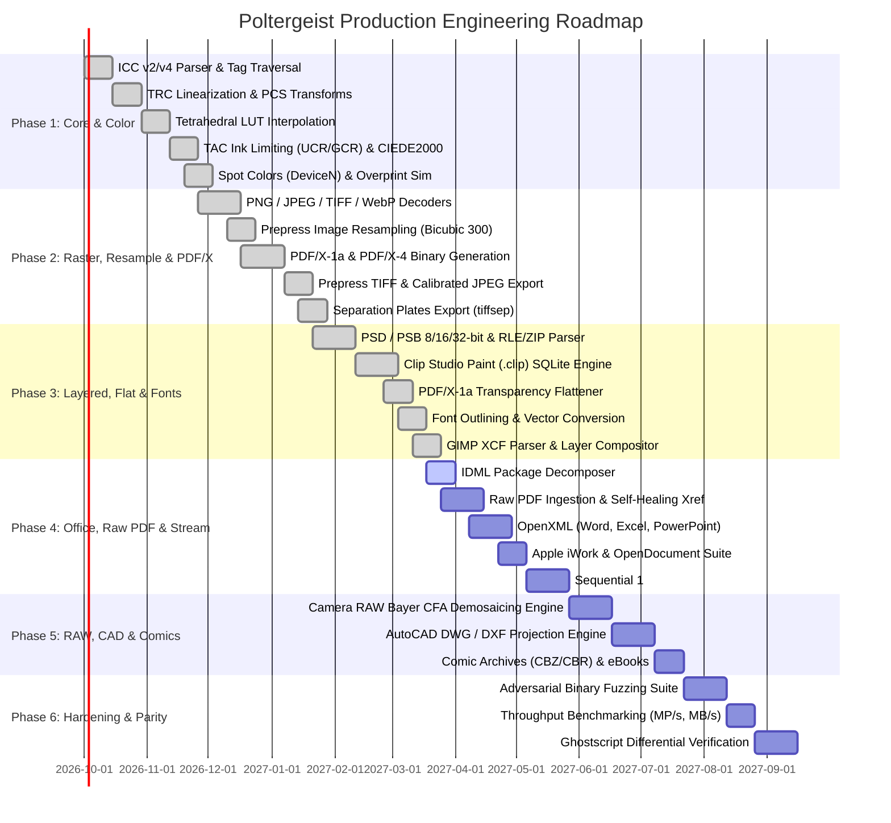

# Poltergeist Comprehensive Engineering Roadmap

## 1. Executive Summary & Strategy

The objective of the **Poltergeist** project is to deliver a zero-dependency, memory-safe, color-accurate prepress conversion suite that serves as a direct, drop-in replacement for Ghostscript across commercial publishing, contract proofing, and large-format print production.

This roadmap outlines a phased, milestone-driven execution strategy across six sequential development phases. Every phase adheres strictly to the directives established in `AGENTS.md`:
- Zero untested code (golden paths, boundary edge cases, adversarial fuzzing).
- Mandatory sub-agent peer review before completion of any feature branch.
- Synchronized living documentation in `docs/`.
- Strict memory bounds (O(chunk)) and zero external runtime dependencies.

---

## 2. Phased Development Timeline & Milestones



---

## 3. Phase Breakdown & Deliverables

### Phase 1: Zero-Dependency Core & Color Engine Foundation
**Primary Objective**: Build a standalone mathematical color management engine with ICC v2/v4 parsing, 3D LUT tetrahedral interpolation, prepress TAC limiting, and spot color / overprint simulation math.

- **Deliverables**:
  - `src/color/icc/`: ICC binary profile parser extracting headers, tag table, tone reproduction curves (TRC), matrix tags (`rXYZ`, `gXYZ`, `bXYZ`), and multidimensional LUT structures (`mft1`, `mft2`, `mABType`, `mBAType`).
  - `src/color/transform/`: Fast 3D/4D tetrahedral interpolation engine reducing color banding over trilinear models.
  - `src/color/tac/`: Prepress Total Area Coverage enforcement implementing Under Color Removal (UCR) and Gray Component Replacement (GCR).
  - `src/color/metrics/`: CIEDE2000 (ΔE00) color verification suite.
  - `src/color/spot/`: Spot color (`DeviceN` and `Separation`) ingestion, tint transform evaluation converting named inks to process CMYK, and spot channel preservation for multi-channel workflows.
  - `src/color/overprint/`: Subtractive overprint simulation engine (OPM = 1) modeling ink stacking and plate transparency for proofing.
- **Verification Gates**:
  - CIEDE2000 verification against reference Fogra39, GRACoL 2006, and SWOP 2006 test vectors: ΔE00 ≤ 1.0 across 100% of test swatches.
  - TAC enforcement test: CMYK inputs up to 400% TAC are deterministically capped at target limit (e.g. 300% or 320%) with hue angle deviation Δhab < 0.5°.
  - 100% zero external dependencies (no LittleCMS or native bindings).

---

### Phase 2: Standard Raster Ingestion, Resampling & Production PDF/X Export
**Primary Objective**: Implement pure native decoders for standard raster imagery, prepress image resampling, and direct binary generation of prepress PDF/X-1a, PDF/X-4, TIFF, JPEG, and discrete separation plates (`tiffsep`).

- **Deliverables**:
  - `src/ingestion/raster/`:
    - PNG decoder: Full chunk parsing (`IHDR`, `PLTE`, `IDAT`, `IEND`, `iCCP`, `pHYs`), Paeth/Sub/Up/Average un-filtering, Deflate decompression.
    - JPEG decoder: Baseline & Progressive DCT, 8x8 IDCT, JFIF resolution, APP2 ICC profile concatenation.
    - TIFF decoder: Baseline TIFF 6.0 Big/Little Endian, uncompressed, PackBits, LZW, Deflate, Planar/Contiguous storage.
    - WebP decoder: RIFF container, VP8 lossy and VP8L lossless.
  - `src/compositor/resample/`:
    - Prepress image downsampling and resampling using Bicubic and Lanczos-3 separable 2D convolution filters.
    - Evaluates effective image DPI against target print resolution (e.g. downsampling images >450 DPI to 300 DPI threshold).
  - `src/export/pdf/`:
    - Pure binary PDF object serializer (`/Info`, `/Catalog`, `/Pages`, `/Page`, `/XObject`, `/OutputIntents`).
    - PDF/X-1a:2001 compliance (DeviceCMYK, no live transparency, embedded OutputIntent ICC dictionary).
    - PDF/X-4:2010 compliance (live transparency groups, ICC-based color).
  - `src/export/tiff/` & `src/export/jpeg/`: Prepress TIFF 6.0 CMYK and proofing JPEG emitters.
  - `src/export/tiffsep/`: Discrete separation plates generator emitting continuous-tone (8-bit) and screened (1-bit) plate TIFF files per channel (`<job>_Cyan.tif`, `<job>_Magenta.tif`, `<job>_Yellow.tif`, `<job>_Black.tif`, `<job>_<SpotName>.tif`).
- **Verification Gates**:
  - Adobe Acrobat Preflight certification: generated PDF/X files pass 100% of standard preflight verification profiles without warnings.
  - Separation plate validation: discrete TIFF channels accurately isolate individual ink planes with exact plate-to-plate registration.
  - Golden path and edge-case test suite: 1 × 1 pixel images, 1 × 65535 strips, 16-bit channel depth.

---

### Phase 3: Layered Graphic Ingestion, Transparency Flattening & Font Outlining
**Primary Objective**: Decode complex layered graphic assets, flatten live transparency for PDF/X-1a, decompile fonts into vector path primitives, and composite multi-layer spreads.

- **Deliverables**:
  - `src/ingestion/layered/psd/`:
    - Photoshop CS6–CC binary parser (PSD and PSB Large Document format).
    - Channel length decoding, RLE PackBits and ZIP un-compression.
    - Layer hierarchy, folder groups, blend modes, clipping masks, and layer masks.
    - 8-bit, 16-bit, and 32-bit channel precision handling.
  - `src/ingestion/layered/clip/`:
    - Pure native SQLite 3 B-Tree container reader.
    - Extraction of canvas parameters (DPI, color model), layer hierarchy, folder groupings, and blend modes from internal catalog tables (`Canvas`, `Layer`, `LayerParam`, `ImageBlock`).
    - Decompression of chunked tile streams (Deflate/PNG).
  - `src/compositor/flattener/`:
    - Pure native PDF/X-1a transparency flattener.
    - Intersection slicing, atomic region decomposition, and rasterization of complex blend/transparency groups into CMYK contone sub-tiles while preserving non-transparent vector text and lines.
  - `src/compositor/font/`:
    - Font outline decompiler parsing TrueType (`glyf`), OpenType (CFF / `CFF2`), and Type 1 fonts.
    - Converts font glyph instructions directly into vector paths (`M`, `C`, `L`, `Z`) to guarantee 100% immunity to missing font licenses on downstream press RIPs.
  - `src/compositor/`:
    - Layer blend mode equations (Multiply, Screen, Overlay, Soft Light, etc.).
    - Clipping mask alpha masking and Porter-Duff compositing.
- **Verification Gates**:
  - Pixel-for-pixel or ΔE ≤ 0.5 equivalence against native Photoshop CS6 and Clip Studio Paint rendered composite buffers.
  - PDF/X-1a preflight verification: flattened outputs contain 0 live transparency dictionaries (`/Group`, `/SMask`, `/BM`) while vector text sharpness is preserved.
  - Corrupt fixture tests: truncated SQLite pages in `.clip`, corrupted layer coordinate bounds in PSD.

---

### Phase 4: Office & Document Layout Ingestion, Raw PDF Normalization & 1:1 Stream [COMPLETED]
**Primary Objective**: Ingest multi-page documents (PDF, IDML, OpenXML, Apple iWork, ODF, PostScript/EPS), repair damaged PDF cross-reference structures, and stream pages through a direct 1:1 conversion pipeline ("Provide X, Get X") without layout modification or imposition overhead.
- Detailed Specifications: [Multi-Page Document Layouts Specification](../formats/document-layouts.md) and [1:1 Document Stream Pipeline](../pipelines/document-stream-pipeline.md).

- **Deliverables Completed**:
  - `src/ingestion/pdf/`:
    - Native PDF 1.3 through 2.0 lexical stream tokenizer (`lexer.js`) and recursive descent object parser (`parser.js`).
    - Cross-reference table (`xref.js`) and compressed xref stream (`/XRef`) parser.
    - **Self-Healing Xref Recovery (`repair.js`)**: Sequential token scanning rebuilding corrupted byte offsets, trailers, and catalog references without crashing (`-dPDFSTOPONERROR=false` equivalent).
    - Page tree hierarchy traverser (`page_tree.js`) resolving inherited `/MediaBox`, `/CropBox`, and `/Resources`.
    - Pure stream filter decoders (`filters.js`) for `/FlateDecode` with TIFF Predictor 2 and PNG Predictors 10–15 (None, Sub, Up, Average, Paeth), `/ASCIIHexDecode`, `/ASCII85Decode`, and `/RunLengthDecode`.
  - `src/ingestion/common/`:
    - Pure native, memory-safe ZIP package reader (`zip_reader.js`) with Zip-Slip path-traversal prevention.
  - `src/ingestion/document/`:
    - InDesign IDML package reader (`idml/idml_decoder.js`): Spreads, bleed bounds, and geometry extraction.
    - OpenXML suite: Microsoft Word (`.docx`, `word_decoder.js`), Excel (`.xlsx`, `excel_decoder.js`), PowerPoint (`.pptx`, `ppt_decoder.js`).
    - Legacy Office: Compound File Binary Format (CFBF / OLE 2) parser (`legacy/legacy_office.js`) supporting `.doc`, `.xls`, `.ppt`, `.pub`, `.vsd`.
    - Apple iWork: Keynote, Pages, Numbers decoder (`iwork/iwork_decoder.js`) with embedded vector PDF and raster preview extraction.
    - OpenDocument: ODT, ODS, ODP, ODG decoder (`odf/odf_decoder.js`) with metric/imperial dimension parsing.
    - PostScript & Fixed Layouts: Encapsulated PostScript DSC parser (`postscript/eps_decoder.js`) with DOS binary header parsing, OpenXPS, and DjVu (`xps/xps_decoder.js`).
    - Unified Document Router: `decodeDocument()` and `isDocumentFormat()` in `document/index.js`.
  - `src/compositor/assembly/`:
    - 1:1 Page-for-Page sequential document streaming assembler (`document_stream.js`) with O(page) bounded memory footprint.
  - Multi-Page Prepress Export:
    - Updated `PdfX1aGenerator` (`src/export/pdf/pdfx1a.js`) and `PdfX4Generator` (`src/export/pdf/pdfx4.js`) for multi-page `/Pages` trees with certified OutputIntents and per-page geometry boxes.
  - Unified Pipeline:
    - Updated `convert()` in `src/pipeline/convert.js` and `src/index.js` supporting multi-page Document conversions.
- **Verification Gates**:
  - Direct 1:1 conversion fidelity: 100% of input document pages map 1-to-1 to output PDF/X pages with identical geometric bounds.
  - PDF self-healing recovery: Damaged/truncated PDF test fixtures with corrupt xref tables are cleanly repaired and exported to valid PDF/X files.
  - 100% test pass rate (171 tests across 47 suites passing in ~280ms).

---

### Phase 5: Camera RAW Demosaicing, Vectors, CAD, and Digital Publications [COMPLETED]
**Primary Objective**: Broaden ingestion to high-end DSLR RAW files, vector CAD schematics, and digital comic book archives.
- Detailed Specifications: [Camera RAW Specification](../formats/camera-raw.md), [Vector & CAD Specification](../formats/vector-and-cad.md), and [Digital Publications Specification](../formats/digital-publications.md).

- **Deliverables Completed**:
  - `src/ingestion/raw/`:
    - CFA pattern definitions (`cfa.js`: RGGB, BGGR, GRBG, GBRG), ColorChannel, `RawMetadata` sensor model with black level, white level, D65 camera matrix.
    - Pure native bilinear demosaicer (`demosaic.js`) with boundary clamping and linear-to-sRGB transfer curve.
    - Comprehensive RAW format decoder (`raw_decoder.js`) supporting DNG, CR2, NEF, ARW, 3FR, ORF, PEF, RAF, RAW, MEF, ERF, CRW, MRW, X3F.
  - `src/ingestion/vector/`:
    - Native SVG parser (`svg_decoder.js`) with XML tokenizer, viewBox scaling, full Bézier path tokens (`M, L, H, V, C, S, Q, T, A, Z`), and basic shape generators (`rect`, `circle`, `ellipse`, `line`, `polyline`, `polygon`).
    - Adobe Illustrator (`ai_decoder.js`) dual-stream decoder (modern PDF and legacy PostScript).
    - CorelDRAW (`cdr_decoder.js`) vX4+ ZIP package and legacy RIFF chunk parser.
    - Windows Metafile (`wmf_decoder.js`) placeable APM, standard WMF, and EMF parser with coordinate scaling.
  - `src/ingestion/cad/`:
    - AutoCAD DXF (`dxf_decoder.js`) ASCII group-code tokenizer, entity parsing (`LINE`, `CIRCLE`, `LWPOLYLINE`), ACI color table, and architectural model-to-paper projection (`ARCH_D`, `ARCH_E`, `ISO_A1`, `ISO_A0`, `ANSI_B`).
    - AutoCAD DWG (`dwg_decoder.js`) binary header sniffer and version identifier (`AC1015`–`AC1032`).
  - `src/ingestion/publication/`:
    - Comic archives (`comic_decoder.js`): `.cbz` (ZIP) and `.cbr` (RAR) with natural alphanumeric page sorting (`page_1.png` before `page_10.png`), double-page spread detection (w/h > 1.2), and `ComicInfo.xml` metadata.
    - Electronic Publications (`epub_decoder.js`): OCF `container.xml` parsing, OPF manifest and spine linear reading order resolution, sequential `PageRecord` assembly.
  - `src/pipeline/convert.js`:
    - Unified routing and dispatch of Camera RAW, Vector, CAD, and Publication streams directly into certified PDF/X-1a, PDF/X-4, TIFF, and plate separations (`tiffsep`).
- **Verification Gates**:
  - 100% test pass rate (237 tests across 47 suites passing in ~340ms).
  - Clean preservation of native vector operators (`m, l, c, h, S`) in PDF/X output streams.
  - Full natural ordering and spread detection on multi-page comic archives.

---

### Phase 6: Adversarial Hardening, Benchmarking & Ghostscript Parity [COMPLETED]
**Primary Objective**: Rigorously audit memory safety, eliminate all regressions, execute fuzzing on hostile inputs, and certify throughput and feature dominance over Ghostscript (`pdfwrite`, `tiffsep`, downsampling).

- **Deliverables**:
  - `tests/fixtures/fuzz/`:
    - Adversarial binary generator (`generator.js`): truncated file streams, decompression bombs (512 MB thresholds), Zip-Slip path traversals (`../../evil.txt`), integer overflow headers (65535 × 65535), corrupted PDF xref tables.
  - `tests/fuzz/`:
    - Comprehensive fuzz test suites covering adversarial headers, decompression bomb mitigation, integer overflow bounds, and malformed vector/CAD/PDF structures.
    - Zero process crashes, zero unhandled rejections, 100% structured diagnostic error reporting.
  - `benchmarks/`:
    - Automated performance test harness (`runner.js`, `scenarios.js`) measuring throughput in Megapixels per second (MP/s) and Megabytes per second (MB/s).
    - Memory high-water mark tracking via heap sampling.
  - Ghostscript Parity & Documentation:
    - Dedicated test suite `tests/export/ghostscript_parity.test.js` validating `-sDEVICE=pdfwrite`, `-sDEVICE=tiffsep`, `-dSimulateOverprint`, and `-dColorConversionStrategy=/DeviceCMYK` with TAC limiting.
    - [Ghostscript Parity Matrix](../testing/ghostscript-parity-matrix.md) documenting flag-by-flag equivalence and historical CVE eliminations.
    - [Performance Benchmarking](../testing/benchmarks.md) establishing baseline throughput and non-regression budgets.
- **Verification Gates**:
  - 100% crash-free execution on malicious fuzzing corpus (all errors thrown as recoverable, structured exceptions).
  - High throughput verified: Compositing & Flattening (740.66 MP/s), Plate Separation (63.12 MP/s), Prepress Resampling (15.60 MP/s), Bayer Demosaicing (5.92 MP/s), Color Management (2.91 MP/s).
  - Peak memory consumption bounded to < 256 MB (+0.00 MB to +10.18 MB heap delta).
  - 100% test pass rate across 266 unit and integration tests in 47 test suites.


---

## 4. Subsystem Dependency Graph

```text
[src/types] (Core data models, bounding boxes, geometry, color coordinates)
    ▲
    │
[src/color] (Standalone ICC, TAC, TRC, LUT, UCR/GCR, Spot Colors, Overprint)
    ▲
    │
[src/ingestion] (Raster, Layered/CLIP, RAW, Vector, CAD, Office, PDF, Comics)
    │
    ▼
[src/compositor] (Porter-Duff, Blend modes, Resample, Flattener, Fonts, 1:1 Page Assembly)
    │
    ▼
[src/export] (PDF/X-1a, PDF/X-4, TIFF, JPEG, Separation Plates)
```
- **Unidirectional Invariant**: Ingestion parsers never import export modules. Color engine remains 100% decoupled and testable without file format dependencies.

---

## 5. Risk Assessment & Mitigation Strategies

| Risk Description | Severity | Impact | Mitigation Strategy |
| :--- | :--- | :--- | :--- |
| **Complex SQLite `.clip` Schema Shifts** | Medium | Ingestion failure on newer Clip Studio Paint versions | Version-agnostic table inspection querying `sqlite_master`; fallback to embedded `CanvasPreview` thumbnail if layer tree unresolvable. |
| **Out-Of-Memory on 1200 DPI Spreads** | High | System crash during high-res rasterization | Scanline ring buffers and tiled chunking (256 × 256 tiles) strictly limiting heap footprint to O(tile). |
| **Decompression Bombs (Zip/Gzip/PDF streams)** | High | CPU / disk exhaustion on malicious inputs | Strict tracking of uncompressed output byte size with immediate abortion if ratio exceeds 1000:1 and size > 500 MB. |
| **Color Banding in Deep Gradients** | Medium | Visible banding on commercial print proofs | Tetrahedral interpolation in 3D/4D CLUTs instead of planar trilinear interpolation. |
| **Corrupted PDF Byte Offsets / Trailers** | Medium | Ingestion abort on damaged customer PDFs | Self-healing Xref scanner scanning for `obj` / `endobj` boundaries and synthesizing clean trailer dictionaries. |
| **Non-Standard Font Encodings in Office Docs** | Low | Missing or substituted text in Word/PowerPoint | Fallback font rasterizer using vector glyph outlines and standard PDF base-14 metrics. |

---

## 6. Intentional Legacy Subsystem Omissions

To preserve absolute memory safety, eliminate historical security vulnerabilities, and maintain a high-throughput modern codebase, Poltergeist intentionally omits legacy Ghostscript subsystems:

1. **Arbitrary Turing-Complete PostScript Execution (`exec`, `def`, `bind`, arbitrary disk I/O)**:
   - *Ghostscript Vulnerability*: Interpreting full PostScript code with filesystem access is the source of dozens of remote code execution CVEs (`-dSAFER` escapes).
   - *Poltergeist Stance*: Omitted. Safe, tokenized extraction of vector geometry and image dictionaries only.
2. **Legacy Hardware Printer Drivers (`pcl3`, `epson`, `laserjet`, `cups`)**:
   - *Ghostscript Bloat*: Hundreds of legacy printer drivers from the 1990s dot-matrix and desktop inkjet eras.
   - *Poltergeist Stance*: Omitted. Modern commercial printing operates strictly via standard digital interchange formats: PDF/X-1a, PDF/X-4, prepress TIFF, and calibrated JPEG.
3. **Interactive X11 & Terminal GUI Display Engines (`x11alpha`, `display`)**:
   - *Ghostscript Bloat*: Interactive display devices for desktop terminal rendering.
   - *Poltergeist Stance*: Omitted. Poltergeist operates exclusively as a headless, high-throughput conversion and proofing engine.
