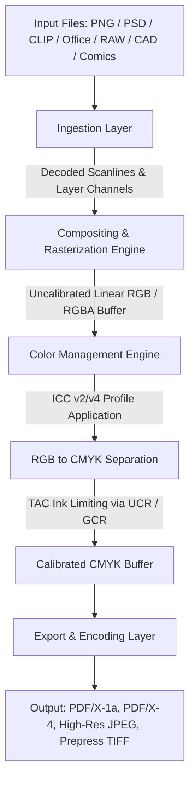

# Poltergeist Architecture & System Overview

## 1. Executive Summary

**Poltergeist** is a memory-safe, zero-dependency file handling and prepress conversion suite designed to replace Ghostscript in high-throughput production environments. It ingests raster and layered graphic assets (PNG, PSD, Clip Studio Paint `.clip`, IDML packages), document and office layouts (OpenXML, Apple iWork, ODF, PostScript, EPS), digital publications (CBZ, CBR, EPUB), CAD schematics (DWG, DXF), and camera RAW digital negatives, executing color separations (RGB $\to$ CMYK) under strict ICC profiles, enforcing prepress Total Area Coverage (TAC) ink limits, and outputting print-ready PDF/X, JPEG, and TIFF files.

Ghostscript has historically suffered from critical security vulnerabilities (memory corruption, arbitrary code execution, and unvalidated postscript evaluation) and unpredictable memory footprints. Poltergeist eliminates these risks by enforcing:
- **Pure Self-Contained Implementations**: Zero dynamic linking to C/C++ libraries (libpng, libjpeg, LittleCMS, Ghostscript, dcraw, unrar).
- **Strict Memory Bounding**: Stream- and scanline-based chunking that limits memory overhead to $O(\text{chunk})$, preventing out-of-memory crashes on multi-gigabyte files.
- **Mathematical Color Determinism**: Bit-identical or floating-point epsilon bounded color conversion across all platforms (macOS, Linux, Windows).
- **Commercial Prepress Compliance**: Complete alignment with digital print and offset commercial submission requirements, including all accepted Mixam formats and Clip Studio Paint (`.clip`).

---

## 2. Pipeline Subsystem Architecture

### 2.1 Modular Ingestion Subsystem (`src/ingestion/`)
Poltergeist classifies all supported file formats into dedicated, decoupled decoder engines:

1. **Layered Graphics Engine (`LayeredDecoder`)**:
   - **PSD / PSB Parser**: Ingests Photoshop documents (8, 16, 32-bit), channel records, layer hierarchies, masks, and blend modes.
   - **Clip Studio Paint Parser (`.clip`)**: Zero-dependency SQLite 3 B-Tree container parser extracting canvas dimensions, layer parameters, blend keys, and zlib/Deflate tiled bitmap streams.
   - **GIMP XCF Parser (`.xcf`)**: Layered hierarchy, tile compression, and floating selection un-packing.

2. **Standard Raster Engine (`RasterDecoder`)**:
   - Pure decoders for PNG, JPEG, TIFF, WebP, BMP, GIF, TGA, PCX, PPM, WBMP, and HEIC (ISOBMFF / HEVC intra tile).
   - Validates signatures, extracts embedded ICC profiles (`iCCP`, `APP2`, TIFF tag 34675), and streams un-filtered scanlines.

3. **Camera RAW Demosaicing Engine (`RawCameraDecoder`)**:
   - Ingests DSLR and medium-format RAW files (`.3fr`, `.arw`, `.cr2`, `.crw`, `.dng`, `.erf`, `.mef`, `.mrw`, `.nef`, `.orf`, `.pef`, `.raf`, `.raw`, `.sr2`, `.x3f`).
   - TIFF/EP structure traversal, Bayer CFA sensor unpacking, black/white level correction, AHD/VNG demosaicing, and camera matrix transformation to CIEXYZ.

4. **Vector & CAD Graphics Engine (`VectorDecoder` & `CadDecoder`)**:
   - **Vector Art**: Ingests SVG, Adobe Illustrator (`.ai` PDF/PGF stream), CorelDRAW (`.cdr`), Encapsulated PostScript (`.eps`), and Windows Metafiles (`.wmf`, `.emf`).
   - **CAD Schematics**: Ingests AutoCAD DWG binary and DXF vector files, projecting model and paper spaces, line weights, and AutoCAD Color Index (ACI) swatches to print bounds.

5. **Document & Office Engine (`PackageDocumentDecoder`)**:
   - Ingests InDesign IDML packages, Microsoft Office OpenXML (`.docx`, `.xlsx`, `.pptx`), Legacy OLE2 (`.doc`, `.xls`, `.ppt`, `.pub`, `.vsd`), Apple iWork (`.pages`, `.key`, `.numbers`), and OpenDocument (`.odt`, `.ods`, `.odp`).
   - Extracts page tree hierarchies, rich text layouts, embedded vector diagrams, and high-resolution raster assets into print-ready spreads.

6. **Publication & Comic Archive Engine (`PublicationArchiveDecoder`)**:
   - Ingests comic archives (`.cbz`, `.cbr`) and eBooks (`.epub`, `.mobi`, `.azw`, `.azw3`, `.fb2`).
   - Natural numeric sorting for page-by-page extraction, preserving sequential page order.

7. **Raw PDF Ingestion & Normalization Engine (`PdfDecoder`)**:
   - Evaluates PDF 1.3 through 2.0 object streams, dictionaries, cross-reference tables (`xref`), and `/XRef` streams.
   - **Self-Healing Xref Recovery**: Recovers and rebuilds damaged byte offsets and broken trailers without crashing.
   - Extracts font dictionaries, vector streams, and embedded contone raster XObjects for preflight normalization to PDF/X.

### 2.2 Compositing & Rasterization Engine (`src/compositor/`)
- Blends layered assets, vector paths, and document frames into unified composite pages.
- Implements Porter-Duff compositing operators, clipping masks, and layer opacity blending.
- **Prepress Image Resampling**: Bicubic and Lanczos-3 separable filtering to downsample oversized raster assets (>450 DPI $\to$ 300 DPI target).
- **PDF/X-1a Transparency Flattening**: Decomposes overlapping transparent vector/raster elements into atomic non-overlapping regions, rasterizing complex blend modes into contone CMYK sub-tiles while preserving non-transparent vector text and lines.
- **Font Outlining & Vector Conversion**: Decompiles TrueType (`glyf`), OpenType (CFF/CFF2), and Type 1 glyph outlines into native vector path primitives (`M`, `C`, `L`, `Z`), guaranteeing complete immunity to missing fonts on downstream RIPs.
- Preserves native page geometry and coordinate boxes without imposition alteration ("Provide X, Get X").
- Computes tile-based or scanline-based rendering to keep memory strictly bounded.

### 2.3 Color Management Engine (`src/color/`)
- **ICC Profile Parser**: Parses ICC.1:2010 (v4.3) and ICC.1:2001-04 (v2) binary profiles. Extracts header fields, tag table, and tag data (curves, `A2B0`, `B2A0`, `mft1`, `mft2`, `mAB`/`mBA` multi-dimensional LUTs).
- **Color Transform Pipeline**: Converts source RGB $\to$ CIEXYZ/CIELAB $\to$ target CMYK using tetrahedral interpolation through 3D/4D LUTs.
- **Prepress TAC Enforcement**: Enforces Total Area Coverage (e.g., 300% for SWOP, 320% for GRACoL). When $C + M + Y + K > \text{TAC}_{\max}$, applies Under Color Removal (UCR) and Gray Component Replacement (GCR) to reduce CMY ink while maintaining neutrality and density via the Black (K) plate.
- **Spot Colors & DeviceN**: Ingests named spot inks (`PANTONE`, `Spot UV`, `CutContour`), applying profile TintTransform functions to CMYK or preserving discrete spot channels.
- **Overprint Simulation (`-dSimulateOverprint`)**: Implements subtractive ink layering models ($OPM = 1$) to simulate physical ink mixing on printing plates for soft proofing.

### 2.4 Export & Encoding Layer (`src/export/`)
- **PDF/X Generator**: Emits standard-compliant PDF/X-1a:2001 and PDF/X-4:2010 print files with embedded CMYK image streams, TrimBox/BleedBox geometry, and OutputIntent ICC dictionaries.
- **JPEG Encoder**: Writes baseline and progressive JPEG files with CMYK or sRGB color space payloads and embedded JFIF/EXIF metadata.
- **TIFF Prepress Encoder**: Writes baseline TIFF 6.0 CMYK files with uncompressed or LZW/Deflate compression and planar or contiguous pixel configurations.
- **Separation Plates Generator (`tiffsep`)**: Emits discrete 8-bit continuous-tone and 1-bit screened plate TIFF files per channel (`Cyan.tif`, `Magenta.tif`, `Yellow.tif`, `Black.tif`, `<SpotName>.tif`) for direct CtP platesetter imaging.

---

## 3. Core Architectural Invariants

1. **Unidirectional Dependency Flow**:
   - `export` may depend on `color` and `types`.
   - `compositor` may depend on `ingestion` and `types`.
   - `color` must remain a standalone mathematical engine independent of file ingestion or export formats.
   - No circular dependencies between any subsystems.
2. **Buffer Integrity & Bounds Checking**:
   - All slice operations, offsets, and stride calculations must explicitly check bounds before reading or writing.
   - Any corrupt packet or malformed chunk must throw a structured, actionable error rather than panicking or reading out-of-bounds memory.
3. **No Dynamic Code Execution**:
   - No `eval()`, `vm.runInContext()`, or dynamic shell invocations. All parsing is deterministic byte traversal.

---

## 4. Intentional Legacy Subsystem Omissions

To eliminate historical Ghostscript vulnerabilities and bloat, Poltergeist explicitly omits:
1. **Arbitrary Turing-Complete PostScript Execution**: No arbitrary PostScript code interpretation (`exec`, `def`, system disk I/O). Safe tokenized path extraction only.
2. **Legacy Hardware Printer Drivers**: No obsolete dot-matrix, PCL, or ESC/P drivers. Modern workflows exchange standard digital files (PDF/X, TIFF, JPEG).
3. **Interactive X11 Displays**: Headless conversion suite with zero desktop GUI dependencies.
