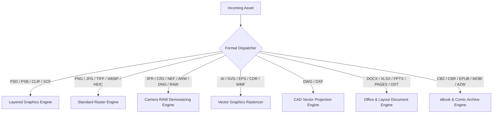

# Poltergeist Supported File Ingestion & Export Formats

## 1. Scope & Invariant Principles

Poltergeist is a universal prepress file handling suite capable of replacing Ghostscript across graphic arts, commercial printing, publishing, and digital proofing workflows. It ingests all file formats supported by professional print services (including the full **Mixam** commercial submission format taxonomy) as well as **Clip Studio Paint** (`.clip`) illustrations.

All ingestion parsers and export engines conform strictly to:
1. **Zero External Runtime Dependencies**: Pure internal decoding without shelling out to `ghostscript`, `imagemagick`, `dcraw`, `unrar`, or dynamic C bindings.
2. **Adversarial Resiliency**: Gracefully reject malformed byte streams, corrupt chunk CRCs, decompression bombs, and hostile offsets with rich, typed diagnostic errors.
3. **Bounded Memory Footprint**: Ingestion operates via scanlines, tiles, or sequential stream extraction (O(chunk)), never allocating O(file_size).

---

## 2. Comprehensive Ingestion Taxonomy

### 2.1 Clip Studio Paint (`.clip`)
- **Developer**: CELSYS.
- **Underlying Architecture**: SQLite 3 container database.
- **Binary Signature**: `53 51 4C 69 74 65 20 66 6F 72 6D 61 74 20 33 00` ("SQLite format 3").
- **Ingestion Pipeline**:
  - Pure zero-dependency SQLite B-tree reader parses internal catalog tables (`Canvas`, `Layer`, `LayerParam`, `ImageBlock`, `CanvasPreview`).
  - Extracts canvas metadata: width, height, resolution (DPI), and color profile (RGB / Monochrome / Grayscale).
  - Resolves layer hierarchy: normal layers, folder groups, vector layers, clipping masks, opacity (0–100%), and blend modes (mapped to PDF/X blend keys).
  - Decompresses block-tiled pixel payloads (chunked Deflate / zlib compressed 8-bit and 16-bit tiles) and reconstructs full layer channels into the compositor pipeline.

---

### 2.2 Adobe Graphic & Layout Formats

#### Adobe Photoshop (`.psd`, `.psb`)
- **Header Signature**: `38 42 50 53` (`8BPS`). Version: `1` for PSD (up to 30,000 px), `2` for PSB (up to 300,000 px).
- **Topology**: File Header → Color Mode Data → Image Resources (`8BIM` tags: resolution info `0x03ED`, embedded ICC `0x040F`) → Layer & Mask Section → Image Data.
- **Compression Modes**: Raw uncompressed, RLE PackBits, ZIP without prediction, ZIP with prediction. Supports 8-bit, 16-bit, and 32-bit channel depths.

#### Adobe InDesign (`.indd`, `.idml`)
- **Ingestion Strategy**: Direct ingestion of **IDML (InDesign Markup Language)** XML packages.
- **Structure**: ZIP archive containing `designmap.xml`, spread descriptors (`Spreads/Spread_*.xml`), graphic resources (`Resources/Graphic.xml`), color swatches (Spot, Process CMYK, RGB), margins, bleed bounds, and linked asset references.

#### Adobe Illustrator (`.ai`)
- **Structure**: Modern `.ai` files are PDF-based containers containing a private Application Dictionary (`/AIPrivateData`) and standard PDF cross-reference stream.
- **Ingestion**: Native PDF object stream parsing extracting high-resolution vector paths, embedded raster artwork, and embedded CMYK/RGB profiles.

---

### 2.3 Mixam Document & Office File Formats (to PDF)

All document and office formats are parsed to extract sequential pages, formatted text runs, embedded imagery, vector line art, and bleed/trim boundaries for direct prepress PDF/X compilation:

| Category | File Extensions | Internal Architecture & Parsing Approach |
| :--- | :--- | :--- |
| **Microsoft Office Word** | `.docx`, `.doc` | `.docx`: OpenXML ZIP container (`word/document.xml`, `word/media/`). Text run formatting, paragraph styles, embedded CMYK/RGB images. `.doc`: Compound File Binary Format (CFBF / OLE2) WordDocument stream. |
| **Spreadsheets & Data** | `.xlsx`, `.xls`, `.ods`, `.csv`, `.xlr` | `.xlsx` / `.ods`: XML sheet tables parsed into print grids, financial tables, and embedded chart vectors. `.csv`: RFC 4180 delimiter parsing with automatic tabular page pagination. |
| **Presentations & Slides** | `.pptx`, `.ppt`, `.odp`, `.pps`, `.ppsx`, `.key`, `.key.zip` | Slide tree traversal (`ppt/slides/slide*.xml`), layout aspect ratio conversion (4:3, 16:9, custom print trim), master slide background rendering, embedded high-res assets. `.key`: Apple iWork IWA / Protobuf package decoding. |
| **Apple iWork Suite** | `.pages`, `.pages.zip`, `.numbers`, `.numbers.zip` | Apple iWork archive decomposition; Protobuf / Snappy stream decompression of index tables, styles, text layouts, and image assets. |
| **OpenDocument Suite** | `.odt`, `.ods`, `.odp`, `.odg` | OASIS OpenDocument XML standard (`content.xml`, `styles.xml`, `Pictures/`) compressed inside standard ZIP containers. |
| **Desktop Publishing** | `.pub` (MS Publisher), `.vsd`, `.vsdx` (Visio) | `.pub`: CFBF / OLE2 container with publisher content streams. `.vsdx`: OpenXML diagram structure with shape geometry, connectors, and layers. |
| **Legacy Word Processing** | `.rtf`, `.wpd`, `.wps`, `.wks`, `.txt` | `.rtf`: Rich Text control word parser (`\rtf1`, `\fonttbl`, `\colortbl`). `.wpd`: WordPerfect binary file syntax. `.txt`: Plaintext stream with automated monospace or proportional typography typesetting. |
| **PostScript & Fixed Layout** | `.eps`, `.ps`, `.xps`, `.djvu` | `.eps` / `.ps`: PostScript Level 2/3 deterministic token evaluation and EPS bounding box (`%%BoundingBox: llx lly urx ury`) clipping. `.xps`: Open XML Paper Specification ZIP package with FixedDocumentSequence. `.djvu`: IW44 wavelet-compressed layered background/foreground text mask streams. |
| **Email & Database Files** | `.eml`, `.msg`, `.mpp` | RFC 822 / RFC 2822 MIME parser (`.eml`) and OLE CFBF parser (`.msg`) extracting formatted HTML/text bodies and high-res attachments. |

---

### 2.4 Mixam Standard Image & Camera RAW Formats (to PDF)

#### Standard Web & Commercial Print Raster
- **PNG (`.png`)**: Critical chunks (`IHDR`, `PLTE`, `IDAT`, `IEND`), ancillary prepress chunks (`iCCP`, `sRGB`, `pHYs`, `gAMA`). Paeth/Sub/Up/Average un-filtering.
- **JPEG (`.jpg`, `.jpeg`)**: Baseline & Progressive DCT, CMYK/YCCK support, EXIF / JFIF metadata, embedded ICC payloads (`APP2`).
- **TIFF (`.tif`, `.tiff`)**: TIFF 6.0 Big-Endian (`MM`) / Little-Endian (`II`), uncompressed, LZW, PackBits, and Deflate compression, Planar / Contiguous storage, multi-page sub-IFDs.
- **WebP (`.webp`)**: RIFF container, VP8 lossy, VP8L lossless (entropy coded), VP8X extended metadata with ICC and alpha.
- **HEIC / HEIF (`.heic`)**: ISO Base Media File Format (`ftypheic`, `ftypmif1`), h.265 / HEVC intra-frame I-slice tile decompression.
- **Legacy Raster**: `.bmp` (DIB header), `.gif` (GIF87a/89a LZW animations / frames), `.tga` (Truevision Targa uncompressed/RLE), `.pcx` (ZSoft Paintbrush RLE), `.ppm` (Netpbm portable pixmap), `.wbmp` (Wireless Bitmap).
- **Application Raster**: `.xcf` (GIMP layered document format), `.mdi` (Microsoft Document Imaging multipage TIFF variant).

#### Vector Formats
- **SVG (`.svg`)**: XML vector DOM, viewBox coordinate spaces, bezier curves (`M`, `C`, `S`, `Q`, `Z`), gradients (`linearGradient`, `radialGradient`), and CSS styling.
- **CorelDRAW (`.cdr`)**: RIFF or ZIP container depending on version (vX4+ uses ZIP with XML), extracting vector curve models and swatches.
- **Windows Metafile (`.wmf`, `.emf`)**: 16-bit and 32-bit GDI record playback, rendering polylines, polygons, font glyphs, and raster brushes.

#### Camera RAW & Digital Negatives
Digital photo assets ingested from high-end DSLR and medium-format cameras:
- **Formats**: `.3fr` (Hasselblad), `.arw` (Sony), `.cr2`, `.crw` (Canon), `.dng` (Adobe Digital Negative), `.erf` (Epson), `.mef` (Mamiya), `.mrw` (Minolta), `.nef` (Nikon), `.orf` (Olympus), `.pef` (Pentax), `.raf` (Fujifilm), `.raw` (Panasonic/Leica), `.sr2` (Sony), `.x3f` (Sigma Foveon).
- **Processing Engine**:
  1. Parse TIFF/EP container structure and raw image IFDs.
  2. Extract raw Bayer CFA (Color Filter Array) sensor mosaic data.
  3. Apply black level subtract and white level normalization.
  4. Perform linear demosaicing (AHD / Adaptive Homogeneity-Directed or VNG interpolation).
  5. Apply camera color matrix calibration (`ColorMatrix1`, `ColorMatrix2`, `ForwardMatrix1`) to map sensor RGB to CIEXYZ Profile Connection Space.

---

### 2.5 Mixam Digital Publications & Comic Book Archives

Digital comic and manga publications frequently require physical prepress conversion:

- **Comic Book Archives (`.cbz`, `.cbr`)**:
  - `.cbz`: ZIP archive of sequential image files (`001.jpg`, `002.png`, etc.).
  - `.cbr`: RAR archive stream extraction.
  - Page Ordering Invariant: Case-insensitive natural numeric sort (`Page_1.jpg`, `Page_2.jpg`, ... `Page_10.jpg`).
  - Automatic double-page spread detection (aspect ratio > 1.2) vs. single page portrait.
- **eBooks (`.epub`, `.mobi`, `.azw`, `.azw3`, `.fb2`, `.chm`, `.lit`, `.lrf`, `.pdb`, `.pml`, `.prc`, `.rb`, `.tcr`, `.cbc`)**:
  - `.epub`: OCF container unzipping, `content.opf` spine manifest ordering, XHTML content rendering, embedded font and SVG support.
  - `.mobi` / `.azw` / `.azw3`: PalmDOC container parsing, Mobipocket record decoding, HTML flow layout extraction.

---

### 2.6 Mixam CAD Vector Formats (`.dwg`, `.dxf`)

Architectural drawings, blueprints, and engineering schematics:
- **Formats**: AutoCAD Drawing (`.dwg` binary), Drawing Exchange Format (`.dxf` ASCII and binary).
- **Entities Handled**: `LINE`, `POINT`, `CIRCLE`, `ARC`, `ELLIPSE`, `LWPOLYLINE`, `SPLINE`, `TEXT`, `MTEXT`, `HATCH`, `DIMENSION`.
- **Prepress Projection**:
  - Model space coordinate normalization to target paper size (Arch A through Arch E, ANSI A through E, ISO A0–A4).
  - Layer visibility and line weight (lineweight → point thickness: e.g. 0.25mm → 0.708 pt) mapping.
  - Conversion of true color and AutoCAD Color Index (ACI) to calibrated CMYK.

---

### 2.7 Raw PDF Ingestion & Preflight Normalization (`.pdf`)

Commercial print workflows heavily utilize Ghostscript's `pdfwrite` device for re-distilling, repairing, and normalizing incoming customer PDF files:
- **Standards Supported**: PDF 1.3, 1.4, 1.5, 1.6, 1.7, and PDF 2.0 (ISO 32000-1 / 32000-2).
- **Self-Healing Xref Recovery Engine**:
  - Parses classic cross-reference tables (`xref`) and modern cross-reference streams (`/XRef`).
  - Gracefully recovers from truncated files, broken byte offsets, and missing trailer dictionaries by scanning token boundaries (`obj` ... `endobj`) sequentially to synthesize a pristine cross-reference catalog without aborting (`-dPDFSTOPONERROR=false` parity).
- **Stream Decompressors**: Pure native decoders for `/FlateDecode`, `/DCTDecode`, `/ASCII85Decode`, `/LZWDecode`, and `/RunLengthDecode`.
- **Preflight Normalization**: Traverses `/Pages` tree, identifying non-compliant color spaces, uncalibrated RGB assets, and live transparency groups for conversion into standard PDF/X-1a:2001 or PDF/X-4:2010.

---

## 3. Direct 1:1 Ingestion-to-Export Paradigm ("Provide X, Get X")

Poltergeist operates strictly on a **"Provide X file, Get X file"** architecture without imposition manipulation:
- **Zero Imposition Alteration**: Poltergeist does not re-impose signatures, re-order booklet folios, calculate paper creep, generate spine wraps, or alter binding punch margins.
- **Strict 1:1 Page Fidelity**: Every input page maps directly to an output page with original coordinates, dimensions, and bleed boxes preserved.
- **Maximum Throughput & Efficiency**: By eliminating unnecessary imposition passes, Poltergeist focuses entirely on raw streaming ingestion, high-speed rasterization/compositing, ICC color space separation, TAC ink limiting, and immediate production export.

---

## 4. Export Formats & Prepress Optimization

Poltergeist compiles all ingested assets into print-standard production outputs:
- **PDF/X-1a:2001 (ISO 15930-1)**: Strict blind exchange, DeviceCMYK + spot colors only, no live transparency, embedded OutputIntent ICC dictionary.
- **PDF/X-4:2010 (ISO 15930-7)**: Modern prepress standard supporting live transparency groups, layers, and ICC-calibrated RGB/CMYK.
- **Prepress TIFF**: CMYK 300/600 DPI with embedded ICC profile and separation channels.
- **Calibrated JPEG**: Proofing JPEG with embedded JFIF DPI and CMYK/sRGB color space.
- **Separation Plates (`tiffsep` Equivalent)**: Emits discrete 1-channel TIFF files (continuous-tone 8-bit or 1-bit screened bitmaps) for each physical printing plate:
  - `<job>_Cyan.tif`
  - `<job>_Magenta.tif`
  - `<job>_Yellow.tif`
  - `<job>_Black.tif`
  - `<job>_<SpotName>.tif` (e.g. `<job>_PANTONE_185_C.tif`, `<job>_Spot_UV.tif`)
- **Prepress Resampling Engine**: Separable 2D Bicubic and Lanczos-3 convolution downsampling oversized raster content exceeding 450 DPI to target 300 DPI.
- **PDF/X-1a Transparency Flattener**: Slices overlapping transparent artwork into atomic non-overlapping regions and rasterizes contone sub-tiles while preserving non-transparent vector text and lines.
- **Overprint Simulation (`-dSimulateOverprint`)**: Simulates subtractive ink mixing (OPM = 1) on physical plates for accurate soft proofs.

---

## 5. Intentional Legacy Omissions

To maintain absolute memory safety and zero-vulnerability guarantees, Poltergeist explicitly omits legacy Ghostscript subsystems:
1. **Arbitrary Turing-Complete PostScript Execution**: No arbitrary PostScript code interpretation (`exec`, `def`, system disk I/O). Safe tokenized path extraction only.
2. **Legacy Hardware Printer Drivers**: No obsolete dot-matrix, PCL, or ESC/P drivers. Modern workflows exchange standard digital files (PDF/X, TIFF, JPEG).
3. **Interactive X11 Displays**: Headless conversion suite with zero desktop GUI dependencies.
